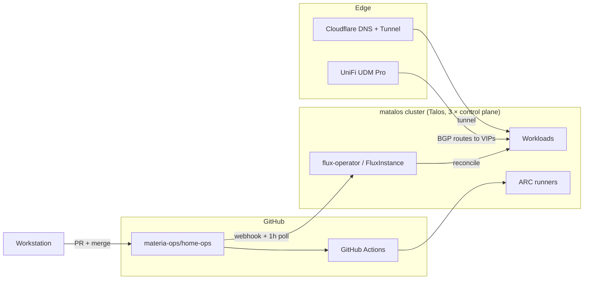
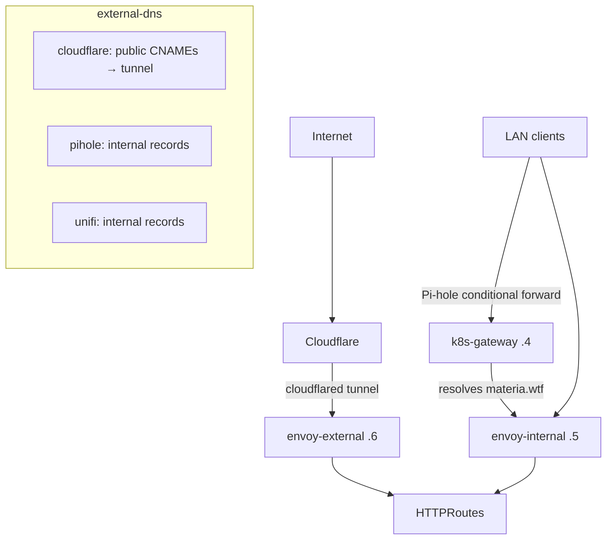
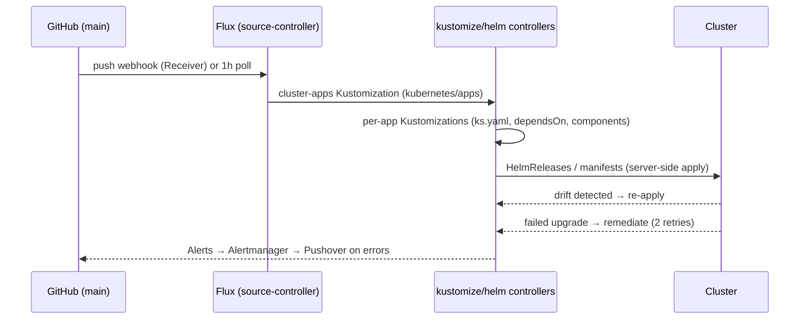

# System Architecture

The **matalos** cluster is a 3-node, highly available [Talos Linux](https://www.talos.dev/)
Kubernetes cluster managed end-to-end with GitOps via [Flux](https://fluxcd.io/)
(flux-operator). Everything that runs in the cluster is declared in this repository;
supporting infrastructure outside the cluster (the two Pi-hole Raspberry Pis) is managed
by Ansible from [`infrastructure/`](../infrastructure).

## Hardware

### Compute

| Node | Type | Hardware | CPU | Memory | IP |
| :--- | :--- | :--- | :--- | :--- | :--- |
| `matalos-c1` | VM on `pve-0` (Proxmox VE) | 8 vCPU / 32 GB, disks passed through | — | 32 GB | `192.168.20.10` |
| `matalos-c2` | Bare metal | Lenovo ThinkStation P330 Tiny | Intel i7-8700 (6C/12T, UHD 630) | 32 GB | `192.168.20.11` |
| `matalos-c3` | Bare metal | Lenovo ThinkStation P330 Tiny | Intel i7-8700 (6C/12T, UHD 630) | 32 GB | `192.168.20.12` |

All three nodes are control-plane nodes with workload scheduling enabled
(`allowSchedulingOnControlPlanes: true`), giving an HA etcd quorum without dedicated
workers. `matalos-c1` is sized (8 vCPU / 32 GB) to match the physical nodes.

**Hypervisor host `pve-0`** — Supermicro X10SDV-4C-TLN2F (Intel Xeon D-1520, 4C/8T),
128 GB ECC. It runs two VMs: `matalos-c1` and the TrueNAS SCALE NAS (4 vCPU / 64 GB).

**GPU note:** the i7-8700 iGPUs (Coffee Lake, UHD 630 / Gen 9.5) are exposed to workloads
via the Intel GPU resource driver and monitored with `drm-exporter`. They are supported
by the `i915` driver only — the newer `xe` driver does not support Gen 9.5.

### Storage devices

Disk roles are declared in the Talos configs ([`talos/machineconfig.yaml.j2`](../talos/machineconfig.yaml.j2)
selects by disk model, [`talos/nodes/`](../talos/nodes) selects the install disk):

| Node | Disk | Role |
| :--- | :--- | :--- |
| `matalos-c1` | Intel Optane 900P 280 GB (`SSDPE21D280GA`) | Talos system disk |
| `matalos-c1` | Corsair MP600 Mini 1 TB | `local-hostpath` user volume (OpenEBS) |
| `matalos-c1` | Micron 7450 960 GB | Ceph OSD |
| `matalos-c2`/`c3` | Samsung 980 1 TB | Talos system disk |
| `matalos-c2`/`c3` | Corsair MP600 Mini 1 TB | `local-hostpath` user volume (OpenEBS) |
| `matalos-c2`/`c3` | Micron 7450 960 GB | Ceph OSD |

**NAS (TrueNAS SCALE VM on `pve-0`)** — passed-through disks: 2 × Intel DC S3700 400 GB
SATA SSD and 6 × Seagate Exos 28 TB (`ST28000NM000C`), plus an LVM virtual root disk.
Serves NFS (v4.2, `nconnect=16`) to the cluster for bulk media storage and the Kopia
backup repository.

### Supporting devices

| Device | Hardware | Role |
| :--- | :--- | :--- |
| `pi-0` | Raspberry Pi 5 16 GB, Argon ONE V3 + NVMe board, Kingston KC3000 512 GB | Pi-hole + dnscrypt (primary home DNS) |
| `pi-1` | Raspberry Pi 4 8 GB, Argon ONE | Pi-hole + dnscrypt (secondary home DNS) |
| `pikvm` | PiKVM | Out-of-band console access |

### Network gear

| Device | Role | Uplink |
| :--- | :--- | :--- |
| UniFi UDM Pro | Gateway / router, BGP peer, WAN (Aussie Broadband) | 10 GbE DAC to aggregation switch |
| UniFi USW Aggregation | 10 GbE SFP+ core | — |
| UniFi USW Pro Max 24 PoE | Access switch (nodes, Pis, PoE) | 2 × 10 GbE DAC LACP to aggregation |
| UniFi U7 Pro Max + U6 Mesh | Wi-Fi (U6 meshed off the U7) | 2.5 GbE |

The NAS/`pve-0` connects to the aggregation switch with 2 × 10 GbE LACP
(SFP+ → RJ45 modules). `matalos-c1` and the NAS VM ride those links; `matalos-c2`/`c3`
hang off the Pro Max, each with a 2 × 2.5 GbE 802.3ad LACP bond (`layer3+4` hash,
MTU 9000).

## Network

### VLANs and addressing

| Network | Purpose |
| :--- | :--- |
| `192.168.1.0/24` | Management (UDM Pro `.1`, UniFi gear, Pi-holes) |
| `192.168.10.0/24` | Cilium LoadBalancer IP pool — VIPs advertised via BGP (the VLAN 10 L2 segment itself is vestigial) |
| `192.168.20.0/24` (VLAN 20) | Cluster nodes — native VLAN on node switch ports |
| VLAN 70 | IoT — tagged on node ports, reaches pods via Multus (`bond0.70`) |
| VLAN 90 | VPN-isolated — tagged on node ports, reaches pods via Multus (`bond0.90`, e.g. qBittorrent) |
| `10.42.0.0/16` | Pod network |
| `10.43.0.0/16` | Service network |

> [!IMPORTANT]
> Bare-metal node switch ports must stay **trunk** (native VLAN 20, tagged 70 + 90).
> Setting them to access mode breaks the Multus sub-interfaces.

### Load balancing (Cilium BGP)

Cilium replaces kube-proxy and announces LoadBalancer VIPs from the
`192.168.10.0/24` pool over BGP: cluster ASN **64514** peering with the UDM Pro
(`192.168.1.1`, ASN **64513**). Notable VIPs:

| VIP | Service |
| :--- | :--- |
| `192.168.10.2` | dnscrypt-proxy (encrypted upstream for the Pi-holes) |
| `192.168.10.4` | k8s-gateway (split DNS for `materia.wtf`) |
| `192.168.10.5` | `envoy-internal` gateway |
| `192.168.10.6` | `envoy-external` gateway |
| `192.168.10.7` | `envoy-internal-tls` gateway (TLS passthrough) |
| `192.168.10.20` | Kubernetes API (`matalos.materia.wtf`) |
| `192.168.10.110` / `.111` / `.113` | Emby / Plex / Notifiarr |
| `192.168.10.120` | AzerothCore realm (`Materia`) |

### Ingress and DNS data flow

Three [Gateway API](https://gateway-api.sigs.k8s.io/) gateways (Envoy Gateway) split
traffic by audience, and three external-dns instances publish records:

- **Public apps** attach `HTTPRoute`s to `envoy-external`; external-dns (cloudflare)
  creates a proxied CNAME to the Cloudflare Tunnel. Flux's webhook receiver
  (`flux-webhook.materia.wtf`) and konflate are exposed this way.
- **Internal apps** attach to `envoy-internal`; resolvable only on the LAN via split DNS
  (Pi-hole → k8s-gateway) plus the pihole/unifi external-dns providers.
- **Plex is grey-clouded** — Plex ToS forbids proxying video through Cloudflare, so its
  record is an unproxied CNAME to the WAN IP (`dynamic.materia.wtf`), not the tunnel.
- **Home DNS chain:** clients → Pi-hole (blocklists) → dnscrypt/NextDNS upstream
  (security heuristics). The in-cluster dnscrypt-proxy at `.2` is the Pi-holes'
  encrypted upstream. A GitHub-webhooks **Skip rule** in the Cloudflare WAF sits above
  the "Block Non AU" geo-block so US-origin webhook deliveries reach the tunnel.

## Kubernetes platform

| Layer | Choice | Notes |
| :--- | :--- | :--- |
| OS | Talos Linux `v1.13.6` | Immutable, API-managed, no SSH; config templated with minijinja + vals |
| Kubernetes | `v1.36.2` | `HPAScaleToZero` feature gate, topology-spread defaults in the scheduler |
| CNI | Cilium | kube-proxy replacement, BGP control plane, L2 announcements available |
| Runtime tuning | | BBR congestion control, jumbo frames end-to-end, `nvme_tcp`/`vfio` modules, 5-minute hardware watchdog |
| Registry mirror | Spegel | Node-to-node P2P image caching — pulls survive registry outages |
| Upgrades | tuppr | Automated Talos and Kubernetes upgrades from `system-upgrade/` |

Talos API access from inside the cluster is restricted to the `actions-runner-system`
and `system-upgrade` namespaces (for CI image pre-pull and tuppr respectively).

## GitOps control plane

Flux is deployed as **flux-operator + FluxInstance** (bootstrap via helmfile, then
self-managed). The reconciliation entrypoint is
[`kubernetes/flux/cluster/ks.yaml`](../kubernetes/flux/cluster/ks.yaml):

The `cluster-apps` Kustomization patches **defaults into every child**: HelmRelease
drift detection, `CreateReplace` CRD handling, rollback cleanup, and
remediation-with-retries. Manual `kubectl` changes to Flux-managed resources are
reverted on the next reconcile — Git is the only durable interface.

## Storage architecture

| Class | Backend | Use |
| :--- | :--- | :--- |
| `ceph-block` (default) | Rook-Ceph, 3 × Micron 7450 NVMe OSDs (`devicePathFilter`, host networking, msgr2) | App state (PVCs) |
| `openebs-hostpath` | OpenEBS LocalPV on the 1 TB Corsair `local-hostpath` user volume | Scratch, VolSync cache |
| NFS | TrueNAS SCALE (`nas.internal`), NFS v4.2 | Bulk media, Kopia backup repository |

**Backups:** the shared [`volsync` component](../kubernetes/components/volsync) gives any
app a `ReplicationSource` (scheduled Kopia snapshot to `nas.internal:/mnt/apps/kopia`)
and a `ReplicationDestination` (bootstrap restore), parameterised per app with
`VOLSYNC_CAPACITY` / `VOLSYNC_SCHEDULE` substitutions. The component also owns the app
PVC, so capacity is defined in exactly one place.

## Secrets

1Password is the single source of truth. Two consumption paths:

- **In-cluster:** 1Password Connect + External Secrets Operator (ESO). Apps declare an
  `ExternalSecret` referencing one 1Password item per app (multiple fields per item).
- **At template/bootstrap time:** `vals` resolves `ref+op://` references inside the
  Talos machine configs and helmfile bootstrap, so no secret material is committed.

Nothing secret lives in Git; `.gitignore` additionally guards local artifacts
(`kubeconfig`, `talosconfig`, tunnel credentials, deploy keys).

## Identity

Authentik (in `security/`) provides SSO: OIDC for apps that speak it, and an
Envoy-integrated forward-auth layer (the
[`authentik-forward-auth` component](../kubernetes/components/authentik-forward-auth))
for apps that don't. Providers, applications, and flows are managed declaratively via
Authentik blueprints.

## Databases

Databases are deployed per-application, not as a shared tier:

- **CloudNativePG operator** (`database/` namespace) for apps that need Postgres.
- **MySQL 8.4 LTS** (`games/azerothcore-db`) for AzerothCore, with its own scheduled
  dumps and VolSync protection.

Schema ownership stays with the upstream applications.
