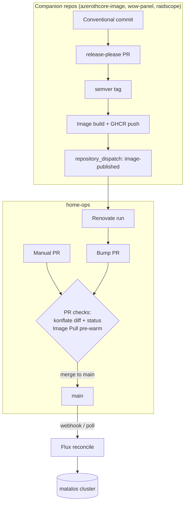

# CI/CD

Everything that runs between "a change exists" and "the cluster runs it". The
contributor-facing view (what *you* must do to keep this green) is in
[repo-workflow.md](./repo-workflow.md).

## The big picture

There are two deployment paths, both converging on Flux:

Nothing deploys from CI directly — CI validates and pre-warms; **Flux is the only
deployer**.

## Runners

Two runner types:

- **GitHub-hosted (`ubuntu-latest`)** for anything that doesn't need LAN access.
- **Self-hosted (`home-ops-runner`)** — Actions Runner Controller (ARC) in the
  `actions-runner-system` namespace, min 1 / max 3, autoscaling per queued job. These
  runners are *inside* the cluster and are granted Talos API access
  (`kubernetesTalosAPIAccess` allows `actions-runner-system`), which is what lets CI run
  `talosctl` against the nodes and Ansible against the Pis.

CI secrets follow the same 1Password-first model as the cluster: workflows load
credentials via `OP_SERVICE_ACCOUNT_TOKEN` (a read-only service account), and anything
needing to write to GitHub uses a short-lived **github-bot App token** (which must carry
`workflows: write` for release automation in the companion repos).

## Workflows in this repo

### `image-pull.yaml` — pre-warm images on PRs

On every PR touching `kubernetes/**`: [flate](https://github.com/home-operations/flate)
diffs the rendered Flux state between the PR and main and extracts the *changed* image
references, then a matrix job on the self-hosted runners runs
`talosctl image pull` on the nodes. By the time the PR merges and Flux rolls the
workload, the image is already on disk — no pull latency, no rollout stuck on a slow
registry.

Private `ghcr.io/materia-ops/*` images are filtered out: the node's containerd has no
GHCR auth for anonymous pulls (they pull fine at pod start via `ghcr-pull-secret`), so
including them would hang the runner. (The filter also covered `ghcr.io/malpractis/*`
during the [GHCR namespace migration](#ghcr-namespace-migration-malpractis--materia-ops);
that prefix was dropped once nothing referenced it.)

### `renovate.yaml` — dependency automation

Self-hosted Renovate run, triggered by:

- an hourly schedule (`20 * * * *`),
- config changes (`.renovaterc.json5`, `.renovate/**`),
- manual dispatch (with dry-run/log-level/version inputs),
- **`repository_dispatch: image-published`** — fired by the companion repos the moment
  they publish an image, so bump PRs open immediately instead of waiting for the
  schedule.

Auto-merge policy (see [`.renovaterc.json5`](../.renovaterc.json5)): mise tools
(minor/patch, 3-day cooldown, branch merge), trusted `home-operations` digests, and this
cluster's own images (semver from release-please). Everything else waits for review.

### `ansible.yaml` — Pi-hole infrastructure

Runs on the self-hosted runners (LAN access to the Pis). Three stages:

1. **Plan** — derives `--tags` from changed paths (`roles/dnscrypt_proxy/` → `dnscrypt`,
   `inventory/group_vars/` → `observability`, structural files → everything).
2. **Check** — `ansible-playbook --check --diff` on every PR *and* push.
3. **Apply** — only on push to `main` (or manual dispatch with `check_only=false`).

The dnscrypt play is `serial: 1` + `any_errors_fatal` with a DNS-resolve verification
between hosts, so a bad change can only take out one Pi-hole before the rollout stops.

### `tag.yaml` — monthly repo tag

Monthly (or manual) date-based tag on `main` via the github-bot App, giving coarse
restore points for the whole cluster state.

### `label-sync.yaml` / `labeler.yaml` — housekeeping

Sync the label set from `.github/labels.yaml` (daily) and auto-label PRs by touched
area (`.github/labeler.yaml`).

## konflate — PR gating and Flux visibility

[konflate](https://github.com/home-operations) runs **in-cluster** (`flux-system`
namespace) connected to `github://materia-ops/home-ops`:

- **PR status checks + diff comments** — renders the Flux state for each PR and posts
  what would change; this is the primary "will this do what I think" gate before merge.
- Serves a web UI at `konflate.materia.wtf` and refreshes state every 15 minutes.

## Flux delivery

- **Receiver webhook** — GitHub `push` events hit
  `flux-webhook.materia.wtf/hook/…` (through the Cloudflare Tunnel), so reconciliation
  starts seconds after merge; the 1 h poll interval is only a fallback. A Cloudflare
  WAF **Skip rule** above the "Block Non AU" geo-block whitelists the webhook paths —
  GitHub delivers from US IPs.
- **Alerts** — Flux notification-controller sends reconciliation errors to the
  in-cluster Alertmanager (→ Pushover), so a failed deploy pages without anyone
  watching CI.

## Companion repo pipelines

Application code lives in separate repos; home-ops only ever consumes their published
images by digest/semver. Their shared pattern:

1. Conventional Commits → **release-please** maintains a release PR
   (feat → minor, fix → patch, `feat!` → major).
2. A human merges the release PR → tag → image build → push to GHCR.
3. The publish job fires `repository_dispatch: image-published` at home-ops → Renovate
   opens (and for these repos auto-merges) the bump PR.

Per-repo notes:

- **azerothcore-image** — ~1h50m builds, so PRs that change build inputs open as
  **draft** (zero builds), get marked ready for exactly **one trial build**, and merge
  only when green (merge *promotes* the trial image by digest, ~3 min; merging mid-build
  causes a full rebuild). Rebase build-input PRs after `main` moves. ccache seeding cuts
  warm builds; `versions.json` is the single realm gate.
- **wow-panel / raidscope** — same release-please pattern; release builds check out the
  **tag ref** (a past bug built from `github.sha` and shipped an empty release — fixed,
  but any broken release can be rebuilt via workflow dispatch from its tag ref).

## GHCR namespace migration (malpractis → materia-ops)

The GitHub org moved from `Malpractis` to `materia-ops` (2026-07-18). Git-side
references (the `FluxInstance` GitRepository URL, konflate's `github://` repo, the
Renovate org preset) point at `materia-ops`, and the **GHCR image move is complete** —
nothing in `kubernetes/` references `ghcr.io/malpractis/*` anymore.

How each old-namespace reference was resolved:

| Reference | Where | Resolution |
| :--- | :--- | :--- |
| `ghcr.io/malpractis/azerothcore-wotlk-playerbots` | [`kubernetes/apps/games/azerothcore/app/helmrelease.yaml`](../kubernetes/apps/games/azerothcore/app/helmrelease.yaml) | Moved to `ghcr.io/materia-ops/azerothcore-wotlk-playerbots` (1.5.1, the first release published under the org) |
| `ghcr.io/malpractis/*` comment | [`kubernetes/apps/games/azerothcore-db/app/pullsecret.yaml`](../kubernetes/apps/games/azerothcore-db/app/pullsecret.yaml) | Comment updated to `ghcr.io/materia-ops/*`; notes the pull PAT stays owned by the personal `malpractis` account |
| `ghcr.io/malpractis/raidscope` / `wlogs-parser` comment | [`kubernetes/apps/default/raidscope/app/helmrelease.yaml`](../kubernetes/apps/default/raidscope/app/helmrelease.yaml) | Historical comment reworded to point here |
| `instance: Malpractis` | [`kubernetes/apps/torrents/qbitmanage/app/externalsecret.yaml`](../kubernetes/apps/torrents/qbitmanage/app/externalsecret.yaml) | Notifiarr instance label renamed to `Materia` (cosmetic) |
| GHCR host-rule username `malpractis` | [`.github/workflows/renovate.yaml`](../.github/workflows/renovate.yaml) | **Stays as-is** — this is the PAT-owning personal account (which still exists), not the org; the token authenticates against `ghcr.io` regardless of image namespace |
| Filter for **both** namespaces | [`.github/workflows/image-pull.yaml`](../.github/workflows/image-pull.yaml) | Narrowed to `ghcr.io/materia-ops/` only — see [image-pull](#image-pullyaml--pre-warm-images-on-prs) above |

> [!NOTE]
> `github.com/Malpractis/...` links in old release notes, commit history, and this
> section are deliberate migration history. Everywhere else in the docs the
> [docs-lint workflow](../.github/workflows/docs-lint.yaml) rejects them.
