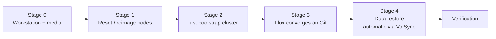

# Disaster Recovery

The total-loss runbook: every node down or wiped → cluster rebuilt → application data
restored. Nothing here is unique to a disaster — it is the normal
[bootstrap](./bootstrap.md) pipeline plus VolSync/Kopia restore, in order. Because the
whole cluster is declared in Git and every stateful app is snapshotted to the Kopia
repository on the NAS, the recovery inputs are: this repository, 1Password, and the NAS.



## Stage 0 — Workstation and prerequisites

Everything runs from a workstation checkout of this repo:

- **Toolchain:** `mise trust && mise install` (talosctl, kubectl, helmfile, kustomize,
  minijinja, vals, gum, just — pinned in [`.mise/config.toml`](../.mise/config.toml)).
- **Local secret files** (gitignored, wired up by mise): the repo-local `talosconfig`
  (Talos API identity — needed to reach the nodes at all), the repo-local `kubeconfig`
  (re-fetched automatically during bootstrap), and `.secrets.env` (environment loaded
  by mise).
- **1Password:** an authenticated `op` session (or service account) that can read the
  `kubernetes` vault — `vals` resolves every `ref+op://` reference through it. The two
  1Password Connect seed secrets applied during bootstrap are the only secrets ever
  injected from a workstation.
- **NAS reachable:** the Kopia repository on the NAS is the restore source for all
  application data.
- **Network:** switch ports for the bare-metal nodes trunked (native VLAN 20, tagged
  70 + 90), so freshly booted nodes come up reachable on `192.168.20.0/24`.

If a machine needs reimaging, build its boot media first:

```sh
just talos download-image <node> <version>   # e.g. just talos download-image matalos-c2 v1.13.6
```

This renders the node's Image Factory schematic (system extensions, bond/VLAN kernel
args) and fetches the ISO — see [bootstrap.md](./bootstrap.md#stage-0--machine-preparation).

## Stage 1 — Reset or reimage the nodes

For nodes that are still running Talos, reset each one back to maintenance mode:

```sh
just talos reset-node <node>       # per node, confirmed
```

This wipes the `STATE`, `EPHEMERAL`, and `u-local-hostpath` partitions — OS
configuration, cluster state, and OpenEBS hostpath volumes. For dead or replaced
hardware, boot the ISO from Stage 0 instead (PiKVM for the P330s, Proxmox console for
`matalos-c1`); a fresh boot lands in maintenance mode ready for Stage 2.

> [!IMPORTANT]
> **Decide what happens to Ceph before you bootstrap.** `reset-node` does **not** wipe
> the Ceph OSDs (the Micron 7450s). Either zap them separately for a genuine
> from-scratch rebuild, or leave them intact and let Rook re-adopt the existing Ceph
> cluster — but decide *before* running Stage 2. App data is recoverable either way via
> VolSync/Kopia from the NAS.

> [!NOTE]
> Repeated rebuilds in a short window can hit Docker Hub / Let's Encrypt rate limits;
> Spegel only mitigates image pulls while at least one node still has the images.

## Stage 2 — `just bootstrap cluster`

One confirmed command runs the whole day-0 pipeline
([`bootstrap/mod.just`](../bootstrap/mod.just)); it is idempotent, so a failed run can
simply be re-run:

| Stage | What it does |
| :--- | :--- |
| `nodes` | Renders and applies each node's Talos machine config (`--insecure`, skips already-configured nodes) |
| `k8s` | `talosctl bootstrap` etcd on the first controller, retried until `AlreadyExists` |
| `kubeconfig` (direct) | Fetches a kubeconfig pinned to a node IP (the API VIP doesn't exist until Cilium is up) |
| `base` | Waits for nodes to register, applies namespaces + the three seed Secrets (via vals/1Password) + CRDs |
| `apps` | `helmfile sync` of the core chain: cilium → coredns → spegel → cert-manager → external-secrets → onepassword-connect → flux-operator → flux-instance |
| `kubeconfig` (final) | Re-fetches the kubeconfig against the real API endpoint, now announced by Cilium |

Full detail per stage in [bootstrap.md](./bootstrap.md#stage-1--just-bootstrap-cluster).

## Stage 3 — Flux converges on Git

The moment the `FluxInstance` is ready, Flux clones `main` and reconciles everything
under `kubernetes/apps/` — adopting the eight bootstrap releases cleanly, since
helmfile installed them from the same values Flux uses. Expect 10–20 minutes of churn
while the dependency ordering works itself out; transient `dependency not ready`
messages are normal. To nudge it (or after fixing something):

```sh
just kube reconcile        # flux reconcile kustomization flux-system --with-source
```

## Stage 4 — Application data restore

**During a rebuild this is automatic.** Every stateful app that opts into the `volsync`
component runs its `ReplicationDestination` before the app starts, so application data
restores from the Kopia repository on the NAS as part of Stage 3 — no per-app action
needed.

For an app that needs a *manual* restore afterwards (bad restore, or rolling a single
app back to an older snapshot):

```sh
just kube restore <namespace> <app> [previous]   # previous defaults to 0 (latest snapshot)
```

The recipe ([`kubernetes/mod.just`](../kubernetes/mod.just)) suspends the app's Flux
Kustomization and HelmRelease, scales the workload to zero, runs a one-off Kopia
`ReplicationDestination` directly into the app PVC (`previous` selects how many
snapshots back), then resumes Flux, force-reconciles the HelmRelease, and waits for the
pod to come back Ready. To inspect data without restoring:

```sh
just kube browse-pvc <namespace> <claim>
```

## Verification

At each stage, from [bootstrap.md](./bootstrap.md#verification) and the
[operations checklist](./operations.md#production-deployment-checklist):

| After | Check |
| :--- | :--- |
| Stage 2 (bootstrap) | `cilium status` — CNI + BGP healthy; `kubectl get nodes` — all `Ready` |
| Stage 3 (Flux) | `flux check` and `flux get ks -A` / `flux get hr -A` — everything `Ready` (the `--status-selector ready=false` variants should come back empty) |
| Storage converged | `kubectl -n rook-ceph get cephcluster` — `HEALTH_OK` |
| DNS | `dig @192.168.10.4 <app>.materia.wtf` — split DNS answering |
| Workloads | Pods running, no CrashLoopBackOff; routes reachable and gatus green; no new alerts after ~15 minutes (Pushover quiet, vmalert clean) |
| Stage 4 (restore) | The restore recipe itself waits for the app pod to be `Ready`; confirm app data in the UI or via `just kube browse-pvc` |

> [!IMPORTANT]
> If an app boots on what *looks* like an empty volume after node disruption, don't
> reach for a restore straight away — it is usually a stale ceph-csi staging path, and
> the data is intact. See the
> [known failure modes](./operations.md#known-failure-modes-and-their-runbooks).
